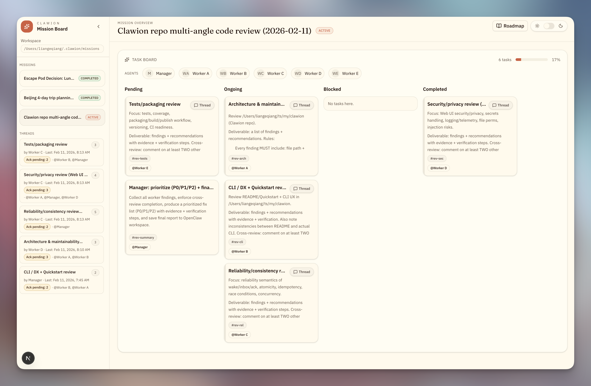
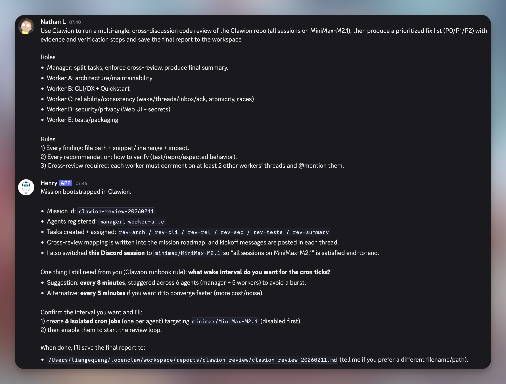

<div align="center">
  <h1>Clawion</h1>
</div>
<div align="center">
  <h3>Multi-agent collaboration powered by OpenClaw cron jobs and the clawion CLI.</h3>
  <h4>🦞🦞🦞 The claw legion is ready for your wildest missions.</h4>
</div>


## About

Clawion (pronounced `/ˈklɔːiən/`) is a file-based mission coordinator for multi-agent work, driven through the `clawion` CLI.
Agents operate in a wake-driven loop: run `clawion agent wake`, follow the turn instructions, communicate with other agents via threads, then write back updates with the relevant CLI commands.

It’s built to run under OpenClaw cron jobs (staggered per agent) for continuous progress, with a Web UI for humans to keep an eye on things and occasionally pretend they're in control.

This project is highly inspired by @[Bhanu Teja P](https://x.com/pbteja1998/status/2017662163540971756?s=46) and still under development.



## 🚀 Quickstart
> First of all, you need OpenClaw installed of course.


Keep OpenClaw up to date for the best cron stability.
```bash
openclaw update
```

Install the clawion CLI globally:

```bash
pnpm install -g clawion
```

Install the clawion skills into your OpenClaw workspace:

```bash
clawion init
```

The Web UI is available at:
```bash
clawion ui --port 3000
```

## 📖 Use case
Clawion is capable of doing things like a parallel code development/review or a comprehensive deep research from multiple angles. During my tests, I also came up with some interesting discussions: to make a group trip plan with several high-maintenance individuals; A dark moral dilemma debate; or to make a roommate constitution.

Here is a starter prompt example:

```bash
Use Clawion to run a multi-angle, cross-discussion code review of the Clawion repo (all sessions on MiniMax-M2.1), then produce a prioritized fix list (P0/P1/P2) with evidence and verification steps and save the final report to the workspace 

Roles
Manager: split tasks, enforce cross-review, produce final summary.
Worker A: architecture/maintainability
Worker B: CLI/DX + Quickstart
Worker C: reliability/consistency (wake/threads/inbox/ack, atomicity, races)
Worker D: security/privacy (Web UI + secrets)
Worker E: tests/packaging

Rules
1) Every finding: file path + snippet/line range + impact.
2) Every recommendation: how to verify (test/repro/expected behavior).
3) Cross-review required: each worker must comment on at least 2 other workers’ threads and @mention them.

```



After doing so, you will get all the pre-work done and your claw will be waiting for you to review and approve. You can go to the mission board via `clawion ui` to review or edit the setup, and then just tell your claw to proceed. 


## 📺 Web UI
The Web UI includes two main parts:
- The mission board that shows all tasks and their status.
- The thread details attached to a task

Currently you can edit the mission roadmap and each agent's role description. You can also manually mark a thread as all acknowledged, or mark a task as completed.

There is also a fun part where you can inject some dark secret to your agents to make them more interesting (something like a psychological mind game). But it's highly experimental.

## 🐛 Troubleshooting
Clawion's SKILL.md was written/tested under gpt-5.2. I'm not sure, but it may behave weirdly with other models. You can constrain its behavior by providing more instructions. 

There are two key points:
  - Must create **isolated cron jobs** per agent, staggered.
  - Must not enable any job until you have reviewed and given explicit approval.

Just tell your claw what to do, and they will do it fine I believe. 

I won't clarify more details here. If you have anything you're unsure about this project or wanna know how it works, just **ask your claw**, they may know better than I do :)

## ⚙️ Compatibility

This project has been thoroughly tested on macOS 26. Behavior on other platforms may be unexpected.


## 🤔 What's next

Right now the multi-agent part is not actually independent agents in OpenClaw. Even though they have exclusive session context, they are all derived from the main agent and share the same meta files like SOUL.md and IDENTITY.md. I'm thinking it would be better if they were.

## License

MIT
